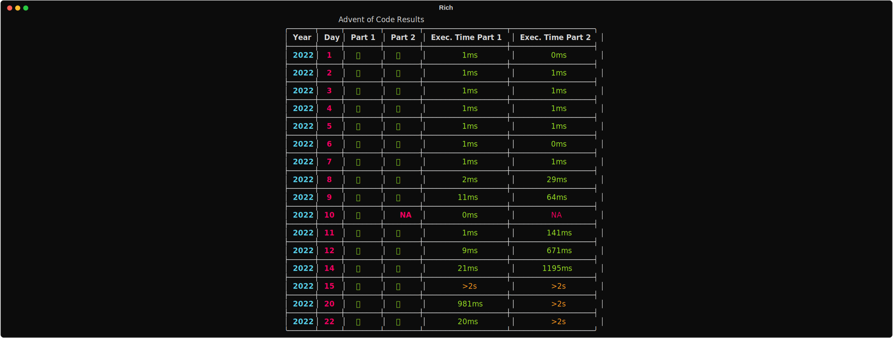
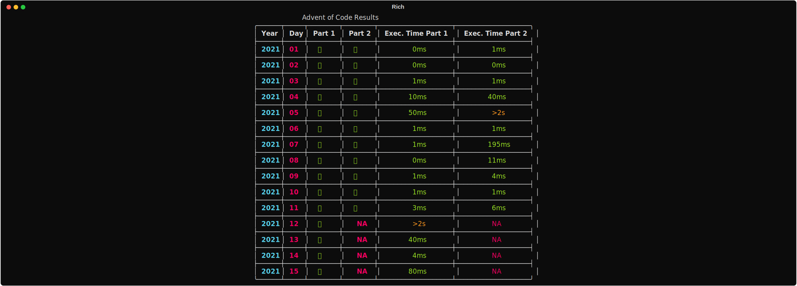

# Advent of code 2020 - 2024

I grouped all my codes done for advent of code (from 2020 to 2024)

Results can be generated with pytest custom pluggin:

AoC 2024 results

AoC 2023 results

AoC 2022 results

AoC 2021 results

