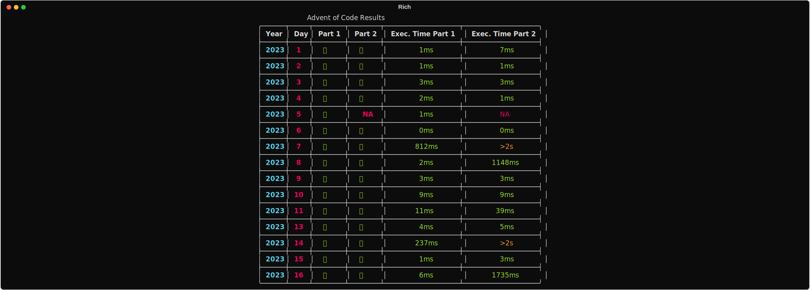
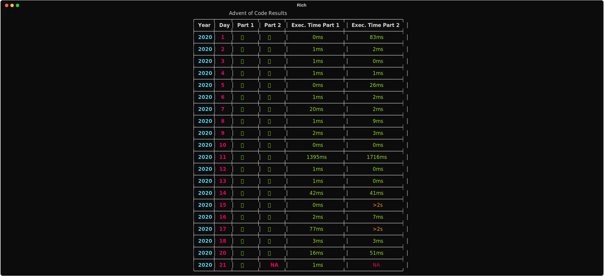

# Advent of code solutions

All my solutions for [advent of code](https://adventofcode.com/) (from 2020 to 2024)

Results can be generated with pytest custom pluggin:

$${\color{green}[2024] \space \color{yellow}48*}$$

$${\color{green}[2023] \space \color{yellow}29*}$$(⬇️ details)

$${\color{green}[2022] \space \color{yellow}40*}$$(⬇️ details)

$${\color{green}[2021] \space \color{yellow}30*}$$(⬇️ details)

$${\color{green}[2020] \space \color{yellow}46*}$$(⬇️ details)

Note: I only used Github Copilot to help me generate tests
